<!-- 
  ========================================================================================
  GLITCH CYBERPUNK PROFILE README - DESIGNED FOR: RAGHUL R C
  ========================================================================================
  RECOMMENDATION: Set C:\Users\rcrag\.gemini\antigravity\scratch\raghul-cyber-readme 
  as your active workspace in your IDE to manage these files.
  
  Theme: Neon Pink, Electric Cyan, Matrix Green, Dark Obsidian Terminal
  Make sure to upload terminal.svg into your repository root so that relative links work.
  ========================================================================================
-->

<div align="center">
  
  <!-- HEADER CAPSULE -->
  
  
  <br>

  <!-- TYPING ANIMATION -->
  <a href="https://git.io/typing-svg">
    
  </a>

  <br>

  <!-- VISITOR COUNTER & SOCIAL BADGES -->
  <p align="center">
    
    &nbsp;&nbsp;
    <a href="https://github.com/raghul-cyber" target="_blank">
      
    </a>
    &nbsp;&nbsp;
    <a href="https://www.linkedin.com/in/raghul-r-c-483703331" target="_blank">
      
    </a>
    &nbsp;&nbsp;
    <a href="mailto:rcraghul12@gmail.com">
      
    </a>
  </p>

</div>

⚡════════════════════════════════════════════════════════════════⚡

## 💻 SYSTEM_PROFILE: ~about_me

<div align="center">
  <!-- REFERENCE TO YOUR ANIMATED TERMINAL SVG -->
  <!-- Note: When you upload this SVG file to your profile repo, this relative link will show your custom matrix coding animation -->
  
</div>

<br>

```bash
raghul-cyber@security-kernel:~$ cat identity_matrix.json
```

```json
{
  "subject": "RAGHUL R C",
  "academic_track": "B.E. Computer Science & Engineering (Cyber Security)",
  "geolocation": "Chennai, India 🇮🇳",
  "specialization": [
    "Smart Contract Exploitation & Auditing",
    "Decentralized Finance (DeFi) Protocols",
    "AI Agent Integration & LLM Architectures",
    "Embedded Hardware & IoT Pipelines"
  ],
  "kernel_version": "v3.2026.05"
}
```

```bash
raghul-cyber@security-kernel:~$ check --status --current-operations
```
- ⚡ **Currently Architecting**: Multi-agent systems running on decentralized infrastructure.
- 🛡️ **Currently Auditing**: Smart contracts for reentrancy, overflow, and front-running vulnerabilities.
- ⚔️ **Organizing**: **Code of Thrones** — 24-hr national hackathon (March 2026) featuring 7 specialized engineering domains.
- 🎓 **Researching**: Cryptographic primitives for hardware-restricted ESP32 environments.

⚡════════════════════════════════════════════════════════════════⚡

## ⚔️ CYBER_ARSENAL: ~skills_and_weapons

```bash
raghul-cyber@security-kernel:~$ load_modules --all
```

### 📂 LANGUAGES & SMART CONTRACTS
<p align="left">
  <a href="https://skillicons.dev">
    
  </a>
</p>

### 📂 WEB3 & BLOCKCHAIN DEPLOYMENTS
<p align="left">
  
  
  
  
  
</p>

### 📂 WEB, MOBILE & HYBRID BACKEND
<p align="left">
  <a href="https://skillicons.dev">
    
  </a>
</p>

### 📂 CLOUD INFRASTRUCTURE & BACKEND
<p align="left">
  <a href="https://skillicons.dev">
    
  </a>
  
  
</p>

### 📂 CYBERSECURITY & PENETRATION TESTING
<p align="left">
  
  
  
  
</p>

### 📂 ARTIFICIAL INTELLIGENCE & LLM ORCHESTRATION
<p align="left">
  
  
</p>

### 📂 ENVIRONMENTS & DEVELOPMENT TOOLS
<p align="left">
  <a href="https://skillicons.dev">
    
  </a>
</p>

⚡════════════════════════════════════════════════════════════════⚡

## 🏆 TROPHIES: ~achievements_matrix

<div align="center">
  
</div>

⚡════════════════════════════════════════════════════════════════⚡

## 🛠️ CRITICAL_PROJECTS: ~deployed_systems

```bash
raghul-cyber@security-kernel:~$ list_projects --deployed --details
```

<div align="center">

### 1️⃣ Aurion Conclave — AI-Secured Multi-Chain Cryptocurrency Wallet
_Next-gen cryptographic asset custody system protected by AI-driven network anomaly modeling._

`Rust` · `React Native` · `Solidity` · `Razorpay API` · `CoinDCX API`

<table>
  <tr>
    <td>🛸 <b>Secure Core</b></td>
    <td>Engineered multi-signature threshold cryptography and fully decentralized client wallet structure.</td>
  </tr>
  <tr>
    <td>🧠 <b>AI Anomaly Detector</b></td>
    <td>Reduced fraud risks by 40% using machine learning behavioral analysis on transactions.</td>
  </tr>
  <tr>
    <td>🏆 <b>Hackathon Recognition</b></td>
    <td>Shortlisted & presented at Graph-e-thon 3.0 (National-level Hackathon with 200+ elite teams).</td>
  </tr>
</table>

<br><br>

### 2️⃣ CivicBridge — India Civic Intelligence Platform
_Unified national dashboard aggregating government databases to yield citizen-centric analytics._

`React` · `Node.js` · `Claude LLM API` · `Leaflet.js` · `Multilingual NLP`

<table>
  <tr>
    <td>🌐 <b>National Coverage</b></td>
    <td>Integrates statistics and API feeds for all 28 Indian States & 8 Union Territories across 88+ datasets.</td>
  </tr>
  <tr>
    <td>🎙️ <b>Multilingual Voice</b></td>
    <td>Built real-time conversational voice interface support in 8 regional Indian languages via NLP layers.</td>
  </tr>
  <tr>
    <td>🛡️ <b>Public Transparency</b></td>
    <td>Guarantees cryptographic integrity of open civic report sheets using hash audits.</td>
  </tr>
</table>


</div>

⚡════════════════════════════════════════════════════════════════⚡

## 📈 SYSTEM_STATISTICS: ~network_traffic

```bash
raghul-cyber@security-kernel:~$ query --metrics --user=raghul-cyber
```

<div align="center">
  <table border="0">
    <tr>
      <td width="50%" align="center">
        
      </td>
      <td width="50%" align="center">
        
      </td>
    </tr>
  </table>
  
  <br>

  
  
  <br><br>
  
  
</div>

⚡════════════════════════════════════════════════════════════════⚡

## 📡 COMM_CHANNELS: ~contact_handshake

```bash
raghul-cyber@security-kernel:~$ establish_handshake --channel=all
```

<div align="center">
  <table border="0">
    <tr>
      <td align="center">
        <a href="mailto:rcraghul12@gmail.com">
          
        </a>
      </td>
      <td align="center">
        <a href="https://www.linkedin.com/in/raghul-r-c-483703331">
          
        </a>
      </td>
      <td align="center">
        <a href="https://github.com/raghul-cyber">
          
        </a>
      </td>
    </tr>
  </table>
</div>

<br><br>

<div align="center">
  <!-- FOOTER WAVE -->
  
</div>
